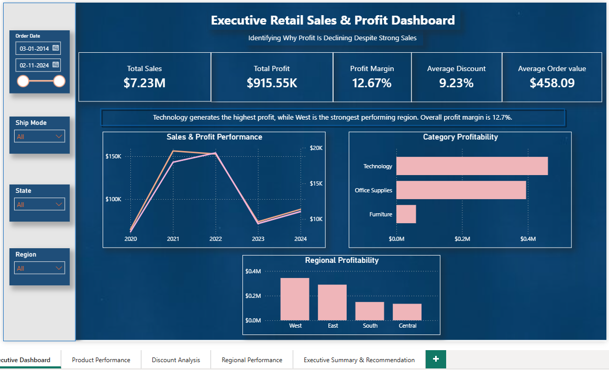
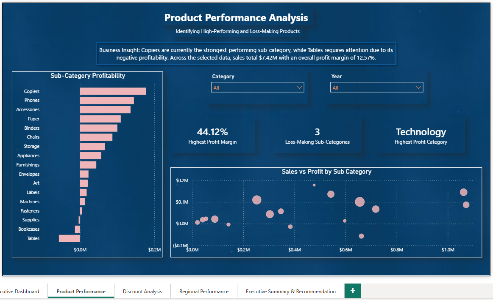
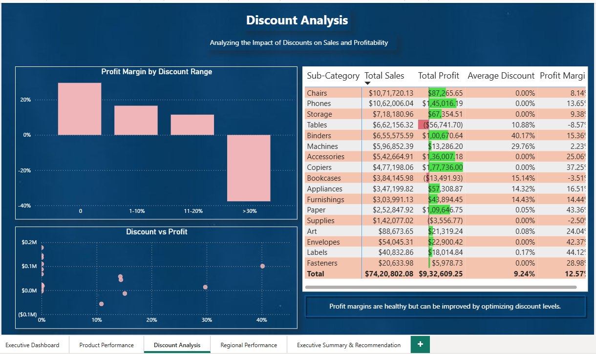
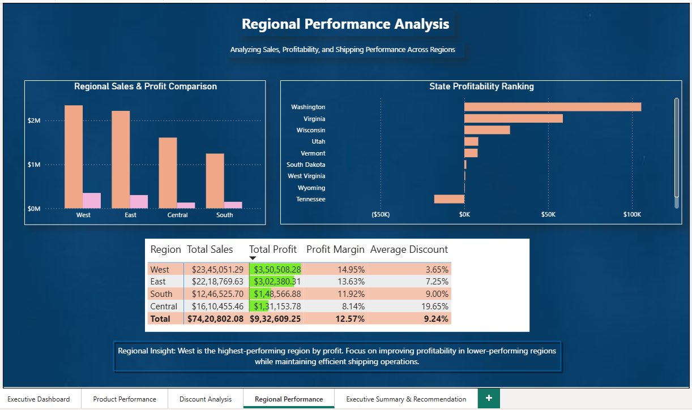
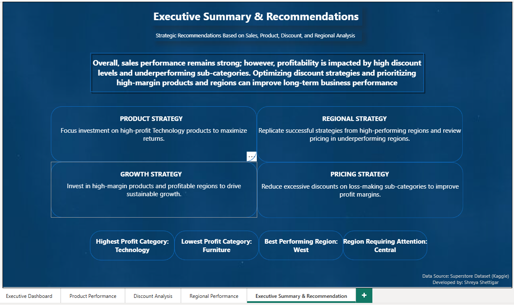

cuti# Sales-Dashboard
# 📊 Executive Retail Sales & Profit Performance Dashboard

## 📌 Project Overview

This Power BI dashboard was developed to investigate a common business challenge:

**"Why is profitability not increasing at the same pace as sales?"**

Using a retail dataset containing **32K+ transactions**, the dashboard analyzes sales, profit, discounts, customer segments, product categories, and regional performance to identify the key factors affecting profitability and support data-driven business decisions.

---

## 🎯 Business Problem

Although the business generated **$7.23M** in total sales, profit margins remained relatively low. The objective of this project was to identify the major drivers impacting profitability and recommend strategies to improve overall business performance.

---

## 📈 Dashboard KPIs

- 💲 Total Sales: **$7.23M**
- 💰 Total Profit: **$915.55K**
- 📊 Profit Margin: **12.67%**
- 🧾 Average Order Value: **$458.09**
- 🎯 Average Discount: **9.23%**
- 📂 Dataset Size: **32K+ Retail Records**

---

## 📑 Dashboard Pages

### 1️⃣ Executive Overview

Provides an overall business performance summary through KPIs, yearly sales and profit trends, category profitability, regional performance, and dynamic business insights.

### 2️⃣ Product Performance Analysis

Analyzes category and sub-category performance to identify high-performing and low-performing products contributing to overall profitability.

### 3️⃣ Discount Analysis

Examines the relationship between discounts, sales, and profit to understand how discount strategies influence business performance.

### 4️⃣ Regional Performance Analysis

Compares regional and state-wise sales and profit to identify the strongest-performing areas and regions requiring improvement.

### 5️⃣ Executive Summary & Recommendations

Summarizes the overall findings and provides business recommendations for improving profitability through pricing optimization, product strategy, and regional performance.

---

## 🔍 Key Insights

- Generated **$7.23M** in total sales with **$915.55K** in total profit.
- Overall business achieved a **12.67% Profit Margin**.
- **Technology** was the highest-profit category.
- **West** emerged as the strongest-performing region.
- **Central** recorded the lowest regional profitability.
- Higher discounts were associated with lower profit margins across several product categories.
- Certain sub-categories generated strong sales but comparatively lower profitability, indicating opportunities for pricing and discount optimization.

---

## 💼 Business Recommendations

- Optimize discount strategies to improve profit margins.
- Prioritize investment in high-margin products and categories.
- Focus on improving profitability in underperforming regions.
- Continuously monitor profit margins alongside sales performance to support sustainable business growth.

---

## 🛠️ Tools & Technologies

- Power BI
- DAX
- Power Query
- Interactive Visualizations
- KPI Dashboard Design

---

## 📷 Dashboard Preview

### Executive Overview



### Product Performance



### Discount Analysis



### Regional Analysis



### Executive Summary



---

## 📂 Repository Contents

```
📁 Executive-Retail-Sales-Profit-Dashboard
│
├── Executive_Retail_Sales_Profit_Dashboard.pbix
├── Retail_Dataset.xlsx
├── README.md
└── screenshots
    ├── executive_dashboard.png
    ├── product_performance.png
    ├── discount_analysis.png
    ├── regional_analysis.png
    └── executive_summary.png
```

---

## 👩‍💻 About the Project

This project was created to strengthen my Power BI and business analytics skills by solving a real-world retail business problem through interactive dashboard development and data-driven storytelling.

---

**Created by Shreya Shettigar**
